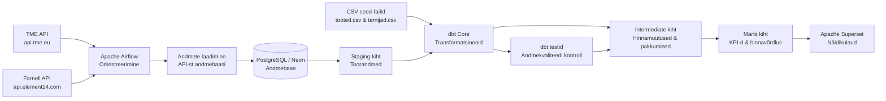

# Andmeinseneeria projektitöö — E-poe tarnijakataloogide haldus- ja seirepaneel

Andmetorude pipeline, mis laadib e-poe tarnijakataloogide andmed **kahest eri allikast** (TME ja Farnell), töötleb need dbt abil ning kuvab tulemused Apache Supersetis.

Tehniline ülevaade: https://mplza.github.io/tarnijakataloogid/tehniline-ulevaade.html

## Äriküsimus

Anda ülevaade elektroonikakomponentide tootekataloogis olevatest toodetest, tarnijatest ja tootjatest ning tuua välja samade toodete hinnaerinevused tarnijate ja tootjate lõikes.

Millised elektroonikakomponendid on erinevate tarnijate ja tootjate lõikes kõige optimaalsema hinnaga?

**Mõõdikud:**

1. Unikaalsete tootjate arv
2. Unikaalsete tarnijate arv
3. Unikaalsete toodete arv
4. Elektroonikakomponentide kategooriate arv
5. TOP 10 kallimat toodet
6. Toodete hinnavõrdluse tabel tootjate, tarnijate lõikes (min, max, soodsaim/kalleim pakkuja)

## Arhitektuur



Täpsem kirjeldus: [`docs/arhitektuur.md`](docs/arhitektuur.md)

## Andmestik

| Allikas | Tüüp | Ajas muutuv? | Roll |
|---------|------|--------------|------|
| TME API v2 (`api.tme.eu`) | REST API (OAuth2) | Jah, iga päev | Põhiandmevoog — toodete hinnad ja laoseis |
| Farnell API (`api.element14.com`) | REST API (API key) | Jah, iga päev | Põhiandmevoog — toodete hinnad ja laoseis |
| `tooted.csv` | seed | Ei, staatiline | Otsinguloend — 600 MPN-i 6 kategooriast |
| `tarnijad.csv` | seed | Ei, staatiline | Kõrvaltabel — tarnijate nimed, riigid ja valuutad |

## Stack

| Komponent | Tööriist |
|-----------|---------|
| Orkestreerimine | Apache Airflow 3.1.8 |
| Transformatsioon | dbt Core 1.12.0-b1 |
| Andmehoidla | PostgreSQL (Neon) |
| Näidikulaud | Apache Superset 6.0.0 |
| Andmeallikad | TME API v2 + Element14/Farnell API v1.2 |
| Andmekvaliteet | dbt tests (59 testist) |

## Andmeallikad

Projekt kasutab **kahte iseseisvat API-t**, millest igaühel oma DAG — see lahendab riski, et kui üks API langeb, teine jätkab andmete laadimist.

### TME API v2 (Poola)
**TME** (`https://api.tme.eu`) — Transfer Multisort Elektronik elektroonikamüüja REST API v2.
- Autentimine: OAuth 2.0 (`client_credentials`), Bearer token kehtib 5 minutit
- Kredentsiaalid: `.env` failist (`API_PRIVATE_KEY`, `API_APP_SECRET`)
- 1 tarnija (TME), EUR hinnad
- DAG: `tme_tarnijakataloog_pipeline`

### Element14 / Farnell API v1.2 (UK)
**Farnell UK** (`https://api.element14.com`) — Briti elektroonikamüüja REST API.
- Autentimine: API võti URL-parameetri kaudu (`ELEMENT14_API_KEY`)
- Pood: `uk.farnell.com`, GBP hinnad (konverteeritakse EUR-iks Frankfurter API kursiga)
- 1 tarnija (FARNELL)
- DAG: `element14_tarnijakataloog_pipeline`

## Projekti struktuur

```
projektitoo-tarnijakataloogid/
├── airflow/dags/
│   ├── tme_tarnijakataloog_pipeline.py           — TME API DAG
│   └── element14_tarnijakataloog_pipeline.py    — Farnell/Element14 API DAG
├── dbt_project/
│   ├── seeds/
│   │   ├── tarnijad.csv                         — tarnijate viitetabel
│   │   └── tooted.csv                           — 600 MPN-i viitetabel
│   └── models/
│       ├── staging/
│       │   ├── stg_tooted.sql                   — puhastatud toorandmed
│       │   └── schema.yml                       — 30 andmekvaliteedi testi
│       ├── intermediate/
│       │   ├── int_toode_hinnamuutus.sql        — hinnamuutused LAG()-ga
│       │   ├── int_tootepakkumised_paeviti.sql  — päevased unikaalsed tooted
│       │   ├── int_toote_hinnad_paeviti.sql     — päevased hinnad toote kaupa
│       │   └── schema.yml                       — 17 andmekvaliteedi testi
│       └── marts/
│           ├── mart_tarnija_kokkuvote.sql       — tarnijate koondstatistika
│           ├── mart_kategooria_hinnajaotus.sql  — hinnajaotus kategooriate kaupa
│           ├── mart_KPI.sql                     — KPI mõõdikud
│           ├── mart_TOP10_kallimat_toodet.sql   — TOP 10 kalleim toode
│           ├── mart_hinnavordlus.sql            — hinnavõrdlus TME vs Farnell
│           ├── mart_hinnamuutus_paeviti.sql     — päevased hinnamuutused
│           ├── mart_toote_hinnavordlus_paeviti.sql — toote hinnavõrdlus päeviti
│           └── schema.yml                       — 12 andmekvaliteedi testi
├── init/01_create_schemas.sql                   — andmebaasi skeemid ja tabelid
├── superset/superset_config.py
├── compose.yml
├── Dockerfile.superset
├── docs/arhitektuur.md
└── .env.example
```

## Käivitamine

```bash
# 1. Kopeeri keskkonnamuutujad ja täida need
cp .env.example .env
# Muuda .env-is: DATABASE_URL, API_PRIVATE_KEY, API_APP_SECRET, ELEMENT14_API_KEY

# 2. Käivita stack
docker compose up -d --build

# Oota ~2-3 minutit, kuni kõik teenused käivituvad

# 3. Ava Airflow UI
# http://localhost:8083  (airflow / airflow)
# → DAGs → Vali DAG (tarnijakataloog_pipeline või element14_tarnijakataloog_pipeline)
# → Trigger DAG

# 4. Ava Superset
# http://localhost:8090  (admin / admin)
```

## Saladused ja konfiguratsioon

Kõik saladused (paroolid, API võtmed, andmebaasi URL-id) on `.env` failis. Repos on ainult `.env.example`, mis näitab vajalike muutujate struktuuri ilma tegelike väärtusteta. Päris `.env` faili ei tohi GitHubi panna — see on `.gitignore`-s.

Vajalikud muutujad:

| Muutuja | Tähendus |
|---------|----------|
| `DATABASE_URL` | Neon PostgreSQL ühenduse URL |
| `API_PRIVATE_KEY` | TME API privaatvõti |
| `API_APP_SECRET` | TME API rakenduse saladus |
| `ELEMENT14_API_KEY` | Farnell/Element14 API võti |
| `POSTGRES_HOST` | Neon hosti aadress (dbt ühendus) |
| `POSTGRES_USER` | Andmebaasi kasutaja (dbt ühendus) |
| `POSTGRES_PASSWORD` | Andmebaasi parool (dbt ühendus) |
| `POSTGRES_DB` | Andmebaasi nimi (dbt ühendus) |

## DAG käitumine

Mõlemad DAG-id (TME ja Element14) käivituvad igapäevaselt (`@daily`) ja koosnevad kolmest taskist:

1. **laadi_kataloogid** — hangib API-st tootesümbolid, hinnad ja laoseisu.
   Salvestab `staging.tooted_raw` tabelisse päevase hetktõmmisena.
   `ON CONFLICT DO NOTHING` tagab, et sama päeva andmeid ei dubleerita.

2. **dbt_run** — käivitab `dbt seed` (csv-id → andmebaasi) ja
   `dbt run` (kõik SQL-mudelid staging → intermediate → marts).

3. **dbt_test** — kontrollib andmekvaliteeti: 59 testist koosnevat test-suite't.
   - Mitte-null väljad kriitilistes veergudes
   - Referentsiaalne integraal (FK validatsioon)
   - Unikaalsus võtmeväljade jaoks

## Andmemudel (3-kihiline Kimball arhitektuur)

```
Staging kiht:
  staging.tooted_raw          ← Airflow laadib siia (TME + Element14)

Intermediate kiht (puhastus + äriloogika):
  staging.stg_tooted          ← dbt view: puhastus, on_laost_otsas flag
  int_toode_hinnamuutus       ← dbt view: hinnamuutused LAG()-ga + tarnija JOIN
  int_tootepakkumised_paeviti ← dbt view: päevased unikaalsed tooted
  int_toote_hinnad_paeviti    ← dbt view: päevased hinnad toote kaupa

Marts kiht (analüütika):
  mart_tarnija_kokkuvote      ← dbt table: tarnijate võrdlus (Superset)
  mart_kategooria_hinnajaotus ← dbt table: kategooriate trendid (Superset)
  mart_KPI                    ← dbt table: unikaalsete toodete/tootjate arv
  mart_TOP10_kallimat_toodet  ← dbt table: TOP 10 kalleim toode
  mart_hinnavordlus           ← dbt table: hinnavõrdlus TME vs Farnell (Superset)
  mart_hinnamuutus_paeviti    ← dbt table: päevased hinnamuutused
  mart_toote_hinnavordlus_paeviti ← dbt table: toote hinnavõrdlus päeviti
```

## Andmekvaliteet

Projektis on **59 automaatset testi**, mis käivituvad iga `dbt test` käigus:

- **Staging layer** (30 testist): not_null väljad, referentsiaalne integraal, unikaalsus
- **Intermediate layer** (17 testist): not_null kriitilistes veergudes
- **Marts layer** (12 testist): not_null, unikaalsus, andmete olemasolu

Testid valideerivad:
✓ Andmete komplektsus (null-arvutused)
✓ Referentsiaalne integraal (tarnija koodid seed-is)
✓ Unikaalsus võtmeväljadel
✓ Andmete olemasolu marts-kihis (row_count > 0)

## Superset seadistamine (esmakordselt)

1. **Lisa andmebaasiühendus:** Settings → Database Connections → + Database
   - Engine: PostgreSQL
   - Connection String: `.env` failist (`DATABASE_URL`)

2. **Lisa datasetid:** Datasets → + Dataset
   - `marts.mart_tarnija_kokkuvote` — tarnijate võrdlus
   - `marts.mart_kategooria_hinnajaotus` — kategooriate trendid
   - `marts.mart_KPI` — KPI mõõdikud
   - `marts.mart_TOP10_kallimat_toodet` — TOP 10 kalleim toode
   - `marts.mart_hinnavordlus` — hinnavõrdlus

3. **Loo graafikud ja dashboard** — kasuta ülaltoodud dataseteid

## Peatamine

```bash
docker compose down        # peatab konteinerid, säilitab andmed
docker compose down -v     # peatab ja kustutab kõik andmed (täielik lähtestamine)
```

## Kokkuvõte, puudused ja võimalikud edasiarendused

**Kokkuvõte:**
- [TODO]

**Puudused:**
- [TODO]

**Mis edasi:**
- [TODO]

## Meeskond

| Nimi | Roll |
|------|------|
| Merilin Paas-Loeza | [Kvaliteedi omanik] |
| Triin Bulõgina | [Transformatsioonide omanik] |
| Bernard Puström | [Andmeallika omanik] |
| Martin Aasna | [Näidikulaua omanik] |
