# Arhitektuur

## Äriküsimus

Anda ülevaade elektroonikakomponentide tootekataloogis olevatest toodetest, tarnijatest ja tootjatest ning tuua välja samade toodete hinnaerinevused tarnijate ja tootjate lõikes.

Millised elektroonikakomponendid on erinevate tarnijate ja tootjate lõikes kõige optimaalsema hinnaga?

## Mõõdikud

1. Unikaalsete tootjate arv
2. Unikaalsete tarnijate arv
3. Unikaalsete toodete arv
4. Elektroonikakomponentide kategooriate arv
5. TOP 10 kallimat toodet
6. Toodete hinnavõrdluse tabel tootjate, tarnijate lõikes (min, max, soodsaim/kalleim pakkuja)

## Andmeallikad

| Allikas | Tüüp | Ajas muutuv? | Roll |
|---------|------|--------------|------|
| TME API v2 (`api.tme.eu`) | REST API (OAuth2) | Jah, iga päev | Põhiandmevoog — toodete hinnad ja laoseis |
| Farnell API (`api.element14.com`) | REST API (API key) | Jah, iga päev | Põhiandmevoog — toodete hinnad ja laoseis |
| `tarnijad.csv` | seed | Ei, staatiline | Kõrvaltabel — tarnijate nimed ja riigid |

### Algandmete kirjeldus

Andmed tulevad TME ja Farnell API-st (elektroonika hulgimüüjad). Iga toote kohta saame:

| Väli | Kirjeldus |
|------|-----------|
| `sumbol` | Toote kood (nt BCR133) |
| `nimi` | Toote nimetus |
| `tootja` | Tootja |
| `kategooria` | Tootekategooria (resistors, capacitors, microcontrollers, led diodes, sensors, connectors) |
| `hind` | Ühiku hind (EUR) |
| `laoseis` | Laos olevate ühikute arv |

Iga päev laetakse 6 kategooria tooted. Iga päev salvestatakse eraldi snapshot, et näha muutusi.

## Andmevoog

```mermaid
flowchart LR
    A[REST API<br>Andmeallikas] --> B[Apache Airflow<br>Orkestreerimine]
    B --> C[Andmete pärimine ja laadimine<br>API-st andmebaasi]
    C --> D[(PostgreSQL / Neon<br>Andmebaas)]

    D --> E[Staging kiht<br>Toorandmete esmane korrastus]
    E --> F[dbt Core<br>Transformatsioonid]
    F --> G[Silver kiht<br>Puhastatud ja standardiseeritud andmed]
    G --> H[Gold kiht<br>Analüüsiks valmis tabelid]

    F --> I[Andmekvaliteedi kontroll<br>dbt testid]
    I --> G

    H --> J[Apache Superset<br>Näidikulaud ja visualiseeringud]
```

## Andmebaasi kihid

- `staging` hoiab API-st saadud päevapõhist lähtekuju;
- `marts` hoiab koondstatistikat tarnija kaupa, hinnajaotust kategooriate kaupa;
- `quality` hoiab andmekvaliteedi testide tulemusi.

## Tööjaotus

| Roll | Vastutus |
|---|---|
| Andmeallika omanik | Kontrollib API vastust ja kirjutab sissevõtu loogika. |
| Transformatsioonide omanik | Kirjutab `mart` kihi tabelid ja mõõdikute arvutuse. |
| Kvaliteedi omanik | Kirjutab testid ja vaatab läbi ebaõnnestunud kontrollid. |
| Näidikulaua omanik | Ehitab Superseti vaate ja seob selle äriküsimusega. |

## Riskid

| Risk | Mõju | Maandus |
|---|---|---|
| API teenuse tõrked: rate limit, tokeni aegumine või API võrguühenduse probleem | Andmed jäävad laadimata | Kasutatakse retry-loogikat suureneva viivitusega ja vajadusel vähendatakse päringupaketi suurust. Tokeni aegumisel uuendatakse token jooksvalt ning päringuid jätkatakse uue tokeniga. Lisaks logitakse erinevad tõrketüübid. |
| API-st saadud andmete kvaliteediprobleemid | Vigased arvutused mart-kihis | dbt testid kontrollivad andmekvaliteeti, staging filtreerib välja null hinnad.

## Privaatsus ja turve

Projektis isikuandmeid ei ole — TME API tagastab ainult tootekataloogide infot (hinnad, laoseis, toodete nimed). Andmebaasi paroolid ja API võtmed on `.env` failis, mis on `.gitignore`-s.
