# Arhitektuur

## Äriküsimus

## Mõõdikud

## Andmeallikad

| Allikas | Tüüp | Ajas muutuv? | Roll |
|---------|------|--------------|------|
| TME API v2 (`api.tme.eu`) | REST API (OAuth2) | Jah, iga päev | Põhiandmevoog — toodete hinnad ja laoseis |
| `tarnijad.csv` | seed | Ei, staatiline | Kõrvaltabel — tarnijate nimed ja riigid |

### Algandmete kirjeldus

Andmed tulevad TME API-st (elektroonika hulgimüüja). Iga toote kohta saame:

| Väli | Kirjeldus |
|------|-----------|
| `sumbol` | Toote kood (nt BCR133) |
| `nimi` | Toote nimetus |
| `tootja` | Tootja |
| `kategooria` | Tootekategooria (resistors, capacitors, microcontrollers, led diodes, sensors, connectors) |
| `hind` | Ühiku hind (EUR) |
| `laoseis` | Laos olevate ühikute arv |

Iga päev laetakse 6 kategooria tooted. Iga päev salvestatakse eraldi snapshot, et näha muutusi.

## Andmevoog

```mermaid
flowchart LR
    A[REST API<br>Andmeallikas] --> B[Apache Airflow<br>Orkestreerimine]
    B --> C[Andmete pärimine ja laadimine<br>API-st andmebaasi]
    C --> D[(PostgreSQL / Neon<br>Andmebaas)]

    D --> E[Staging kiht<br>Toorandmete esmane korrastus]
    E --> F[dbt Core<br>Transformatsioonid]
    F --> G[Silver kiht<br>Puhastatud ja standardiseeritud andmed]
    G --> H[Gold kiht<br>Analüüsiks valmis tabelid]

    F --> I[Andmekvaliteedi kontroll<br>dbt testid]
    I --> G

    H --> J[Apache Superset<br>Näidikulaud ja visualiseeringud]
```

## Andmebaasi kihid

## Tööjaotus

## Riskid

## Privaatsus ja turve

Projektis isikuandmeid ei ole — TME API tagastab ainult tootekataloogide infot (hinnad, laoseis, toodete nimed). Andmebaasi paroolid ja API võtmed on `.env` failis, mis on `.gitignore`-s.
