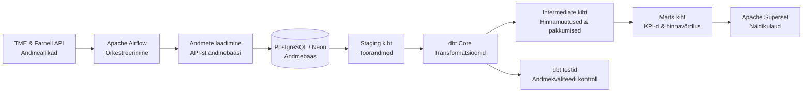

# Arhitektuur

## Äriküsimus

Anda ülevaade elektroonikakomponentide tootekataloogis olevatest toodetest, tarnijatest ja tootjatest ning tuua välja samade toodete hinnaerinevused tarnijate ja tootjate lõikes.

Millised elektroonikakomponendid on erinevate tarnijate ja tootjate lõikes kõige optimaalsema hinnaga?

## Mõõdikud

1. Unikaalsete tootjate arv
2. Unikaalsete tarnijate arv
3. Unikaalsete toodete arv
4. Elektroonikakomponentide kategooriate arv
5. TOP 10 kallimat toodet
6. Toodete hinnavõrdluse tabel tootjate, tarnijate lõikes (min, max, soodsaim/kalleim pakkuja)

## Andmeallikad

| Allikas | Tüüp | Ajas muutuv? | Roll |
|---------|------|--------------|------|
| TME API v2 (`api.tme.eu`) | REST API (OAuth2) | Jah, iga päev | Põhiandmevoog — toodete hinnad ja laoseis |
| Farnell API (`api.element14.com`) | REST API (API key) | Jah, iga päev | Põhiandmevoog — toodete hinnad ja laoseis |
| `tooted.csv` | seed | Ei, staatiline | Otsinguloend — 600 MPN-i 6 kategooriast, mille järgi API-dest päritakse |
| `tarnijad.csv` | seed | Ei, staatiline | Kõrvaltabel — tarnijate nimed, riigid ja valuutad |

### Algandmete kirjeldus

Andmed tulevad TME ja Farnell API-st (elektroonika hulgimüüjad). Iga toote kohta saame:

| Väli | Kirjeldus |
|------|-----------|
| `mpn` | Tootja-osakood (Manufacturer Part Number), mille järgi mõlemast API-st otsitakse |
| `sumbol` | Poe sisemine tootekood (TME symbol / Farnell SKU) |
| `nimi` | Toote nimetus |
| `tootja` | Tootja (nt VISHAY, STMicroelectronics) |
| `kategooria` | Tootekategooria (resistors, capacitors, microcontrollers, led diodes, transistors, connectors) |
| `hind` | Ühiku hind väikseimal kogusetasandil |
| `valuuta` | Valuuta (TME: EUR, Farnell: GBP) |
| `min_kogus` | Minimaalne tellitav kogus salvestatud hinna juures |
| `laoseis` | Laos olevate ühikute arv |

Otsitavad MPN-id on defineeritud `tooted.csv` seed-failis (600 MPN-i, 6 kategooriat × 100). MPN-id on valitud nii, et iga MPN annab mõlemas API-s sama unikaalse toote vaste.

`tarnijad.csv` sisaldab tarnijate põhiandmeid (nimi, riik, valuuta). `tooted.csv` määrab milliseid tooteid API-dest otsitakse.

## Andmevoog

## Andmebaasi kihid

- `staging` hoiab API-st saadud päevapõhist lähtekuju;
- `marts` hoiab koondstatistikat tarnija kaupa, hinnajaotust kategooriate kaupa;
- `quality` hoiab andmekvaliteedi testide tulemusi.

## Tööjaotus

| Roll | Vastutus | Nimi |
|---|---|---|
| Andmeallika omanik | Kontrollib API vastust ja kirjutab sissevõtu loogika. | Bernard |
| Transformatsioonide omanik | Kirjutab `mart` kihi tabelid ja mõõdikute arvutuse. | Triin |
| Kvaliteedi omanik | Kirjutab testid ja vaatab läbi ebaõnnestunud kontrollid. | Merilin |
| Näidikulaua omanik | Ehitab Superseti vaate ja seob selle äriküsimusega. | Martin |

## Riskid

| Risk | Mõju | Maandus |
|---|---|---|
| TME API tõrge (rate limit, tokeni aegumine, võrguprobleem) | TME andmed jäävad laadimata, hinnavõrdlus puudulik | Retry-loogika suureneva viivitusega. Tokeni aegumisel uuendatakse token jooksvalt. Farnell DAG töötab edasi iseseisvalt. |
| Farnell API tõrge (API võti aegub, teenus maas) | Farnell andmed jäävad laadimata, ainult TME hinnad saadaval | Eraldi DAG tagab, et TME andmed laetakse sõltumatult. Retry-loogika proovib päringut kuni 5 korda. DAG feilimise korral tuleb viga käsitsi uurida Airflow logidest. |
| Mõlemad API-d korraga maas | Päeva andmed jäävad täielikult laadimata | Eelmiste päevade andmed jäävad alles — mart-kiht näitab viimast saadaolevat seisu. Mõlemad DAG-id tuleb pärast taastumist käsitsi uuesti käivitada. |
| Seed CSV-de viga (vigane formaat, puuduv MPN) | Pipeline laeb valesid tooteid või jätab osa vahele | Seed-failid on versioonihalduses, muudatused läbivad code review. Vigase formaadi korral feilib `dbt seed` enne kui andmed mudelitesse jõuavad. |
| API-st saadud andmete kvaliteediprobleemid | Vigased arvutused mart-kihis | dbt testid kontrollivad not_null, unikaalsust ja referentsiaalset integraali. Staging filtreerib välja null hinnad (`WHERE hind IS NOT NULL`). |
| Andmete hilinemine (DAG run ebaõnnestub, andmed jõuavad üle päeva) | Marts-kihi näitajad on aegunud, hinnavõrdlus ei kajasta tänast seisu | Iga päeva andmed salvestatakse eraldi snapshot'ina — hilinenud laadimine ei kirjuta üle varasemaid andmeid. `ON CONFLICT DO NOTHING` väldib dubleerimist. |
| Airflow teenuse tõrge (konteiner crashib, DAG run feilib pooleli) | Andmed jäävad laadimata või osaliselt laadituks | `ON CONFLICT DO NOTHING` tagab, et korduskäivitus ei dubleeri andmeid. DAG-i saab käsitsi uuesti käivitada. |
| Skaleeritavus — andmeallikate arvu kasv (nt 2 → 20 tarnijat) | Iga tarnija vajab eraldi DAG-i ja API-loogika kohandamist | Praegune arhitektuur on loodud kahe tarnija jaoks. Suurema arvu korral tuleks DAG-i loogika üldistada parametriseeritavaks ja seed-tabelitesse lisada tarnijapõhised seaded. |
| Skaleeritavus — toodete arvu kasv (600 → tuhandeid MPN-e) | API päringute arv ja andmebaasi maht kasvavad, pipeline aeglustub | Praegu tehakse iga MPN kohta eraldi päring. Suurema mahu korral tuleks kasutada batch-päringuid ja indekseerida andmebaasi tabelid. |
| Andmete turvalisus (API võtmete leke) | Kolmandad osapooled pääsevad ligi API-dele | API võtmed ja paroolid hoitakse `.env` failis, mis on `.gitignore`-s. Kredentsiaalid ei ole koodis ega versioonihalduses. |
| Neon andmebaasi tõrge (pilveteenus maas) | Kogu pipeline seiskub — ei saa andmeid kirjutada ega lugeda | Airflow DAG feilib ja logib vea. Andmebaasi taastumisel tuleb DAG käsitsi uuesti käivitada. `ON CONFLICT DO NOTHING` tagab, et korduskäivitus ei tekita duplikaate. |
| GBP→EUR valuutakursi viga (Frankfurter API tõrge või vale kurss) | Farnell hinnad konverteeritakse valesti, TME vs Farnell hinnavõrdlus on ebatäpne | Frankfurter API kasutab ECB ametlikke kursse. Kui API ei vasta, kasutatakse fallback-kursi (1.18 GBP→EUR). Kasutatud kurss salvestatakse staging-kihis (`valuuta_eur_kurss` veerg), mis võimaldab tagantjärele kontrollida. |

## Privaatsus ja turve

Projektis isikuandmeid ei ole — TME ja Farnell API-d tagastavad ainult tootekataloogide infot (hinnad, laoseis, toodete nimed). Andmebaasi paroolid ja API võtmed on `.env` failis, mis on `.gitignore`-s.
